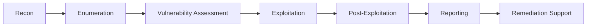

# 🔐 Security Researcher | Penetration Tester

<div align="center">
  
  [](https://yeswehack.com)
  [](https://yogosha.com)
  [](https://linkedin.com)
  
  ```python
  #!/usr/bin/env python3
  
  class PenTester:
      def __init__(self):
          self.name = "kless14"
          self.role = "Security Researcher"
          self.location = "Paris, France"
          self.current_focus = ["Web Security", "API Testing", "Cloud Security"]
          
      def say_hello(self):
          print("Thanks for visiting! Let's make the web safer together ")
  
  me = PenTester()
  me.say_hello()
  ```
</div>

---

##  **Current Focus**

```bash
$ whoami
> Freelance Pentester hunting bugs and securing applications

$ cat /current_missions
> 🔍 Active on bug bounty programs
> 🛠️ Building security automation tools  
> 📚 Researching cloud misconfigurations
> 🎓 Contributing to open-source security projects
```

##  **Security Arsenal**

### **Web Application Testing**


### **Infrastructure & Network**


### **Languages & Scripting**


### **Cloud & Containers**


---

##  **Security Achievements**

```yaml
bug_bounties:
  platforms: ["YesWeHack", "Yogosha"]
  vulnerabilities_reported: 15+
  specialties: 
    - IDOR (Insecure Direct Object Reference)
    - Authentication Bypass
    - Information Disclosure
    - API Security Issues
    - Business Logic Flaws

certifications:
  in_progress: ["OSCP", "PNPT"]
  completed: ["Security fundamentals"]
```

## 📊 **Current Projects**

| Project | Description | Tech Stack | Status |
|---------|-------------|------------|--------|
|  **Recon Automation** | Custom reconnaissance framework for bug bounty | Python, Bash, APIs | 🚧 In Progress |
|  **Security Checklist** | Automated security validation for CI/CD | Python, Docker | ✅ Active |
|  **Pentest Reports** | Template generator for pentest reports | Python, Markdown | 📋 Planning |
|  **Vuln Scanner** | Lightweight vulnerability scanner | Go, Nuclei | 🚧 In Progress |

---

##  **Services Available**

<table>
<tr>
<td width="33%" valign="top">

###  **Express Security Check**
- OWASP Top 5
- 24-48h delivery  
- Quick wins report
- **149€**

</td>
<td width="33%" valign="top">

###  **Standard Pentest**
- OWASP Top 10
- API Testing
- Detailed report
- **449€**

</td>
<td width="33%" valign="top">

###  **Advanced Pentest**
- Full infrastructure
- Code review
- Training included
- **899€**

</td>
</tr>
</table>

---

## 📈 **GitHub Stats**

<div align="center">
  
  
  
  
  
</div>

---

## 🎯 **Vulnerability Research Focus**



---

##  **Latest Security Research**

<!-- This section can be automated with GitHub Actions -->
- 🔬 **Research:** Cloud Misconfigurations in AWS S3 Buckets
- 📝 **Article:** IDOR Vulnerabilities in Modern APIs
- 🛠️ **Tool Release:** Automated Subdomain Takeover Scanner
- 💡 **CVE Research:** Analysis of recent critical vulnerabilities

---

##  **Connect & Collaborate**

<div align="center">

### ** Let's Talk Security**

Looking for a pentester? Need security consultation? Want to collaborate on security research?

[](https://t.me/kless14)
  
💼 **Hire me:** Available for freelance projects  
🐛 **Bug Bounty:** Active on YesWeHack & Yogosha  

</div>

---

## 🔥 **Security Philosophy**

> "The best way to secure a system is to think like an attacker, but act like a defender."

```javascript
while (true) {
    learn();
    hack();
    secure();
    repeat();
}
```

---

<div align="center">
  
  ### **Visitor Counter**
  
  
  ⚡ **Fun fact:** I use Vim for everything, even this README
  
  ---
  
  **[Portfolio](https://github.com/kless14)** • **[LinkedIn](https://linkedin.com)** • **[Twitter](https://twitter.com)**
  
  *Last updated: January 2025*
  
</div>
